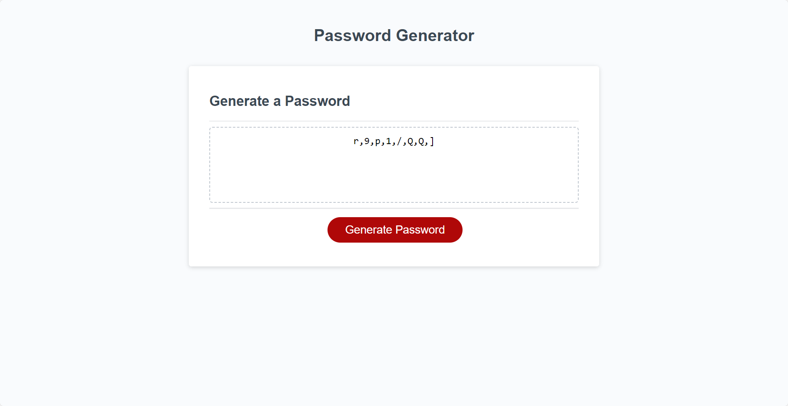

# Password Generator

## Description 

This repository contains a collection of code for performing various financial calculations using only JavaScript and the browser's console.




## Deployment

The deployed version can be accessed [here](https://borregaio.github.io/password-generator/).


## Key Features

1. **Total Months:** Calculate the total number of months included in the dataset.

2. **Net Total Profit/Loss:** Determine the net total amount of Profit/Losses over the entire period.

3. **Average Change:** Find the average of the changes in Profit/Losses over the entire period.

4. **Greatest Increase:** Identify the date and amount of the greatest increase in Profit/Losses over the entire period.

5. **Greatest Decrease:** Identify the date and amount of the greatest decrease in Profit/Losses over the entire period.


## Installation

### Clone the repository
```console
git clone https://github.com/borregaio/password-generator.git
```

### Navigate to the project directory
```console
cd password-generator
```

### Open with VSCode
```console
code .
```

## Steps Followed to Calculate the Tasks

1. **Total Months:**
    - The 'length' property is used to calculate how many months there are on the data set.

        ```javascript
        var totalMonths = finances.length;
        ```

2. **Net Total Profit/Loss:**
    - A new variable is created (totalAmount), then a 'for loop' will go through each items's second value ([i][1]) and add it to the 'totalAmount' variable.

        ```javascript
        var totalAmount = 0;

        for (let i = 0; i < finances.length; i++) {
            totalAmount += finances[i][1];
        }
        ```


3. **Average Change:**
    - A new variable 'sumOfChanges' is created to store the sum of all numeric values.

        ```javascript
        var sumOfChanges = 0;
        ```

    - With a 'for loop', the change between the current financial value (currentFinancialValue) and the previous financial value (previousFinancialValue) is stored in the variable 'change'. Then, the value of 'change' is added up to the variable 'sumOfChanges'.

        ```javascript
        for (let i = 1; i < finances.length; i++) {
            var currentFinancialValue = finances[i][1];
            var previousFinancialValue = finances[i - 1][1];
            var change = currentFinancialValue - previousFinancialValue;
        
            sumOfChanges += change;
        }
        ```

    - The average change is calculated, using the 'toFixed()' method to round to two decimal places.

        ```javascript
        var averageChanges = (sumOfChanges / (finances.length - 1)).toFixed(2);
        ```

4. **Greatest Increase:**
    - Two variables are created to store the greatest increase (greatestIncrease) and the gretest increase month (greatestIncreaseMonth).

        ```javascript
        var greatestIncrease = 0;
        var greatestIncreaseMonth = '';
        ```

    - A 'for loop' is used to store the current financial value (currentFinancialValue) and the previous financial value (previousFinancialValue) to the 'increase' variable.

        ```javascript
        for (let i = 1; i < finances.length; i++) {
            var currentFinancialValue = finances[i][1];
            var previousFinancialValue = finances[i - 1][1];
            var increase = currentFinancialValue - previousFinancialValue;
        ```

    - An 'if statement' is run to add the greatest increase to the 'greatestIncrease' varible with its respective month.

        ```javascript
        if (increase > greatestIncrease) {
            greatestIncrease = increase;
            greatestIncreaseMonth = finances[i][0];
        }
        }
        ```

5. **Greatest Decrease:**
    - The same process is followed to calculate the greatest decrease, with the only difference being a change in the order during the 'decrease' variable calculation.

        ```javascript
        var decrease = previousFinancialValue - currentFinancialValue;
        ```

6. **Testing:**
   - Verified that the website maintains its visual consistency after the refactoring.